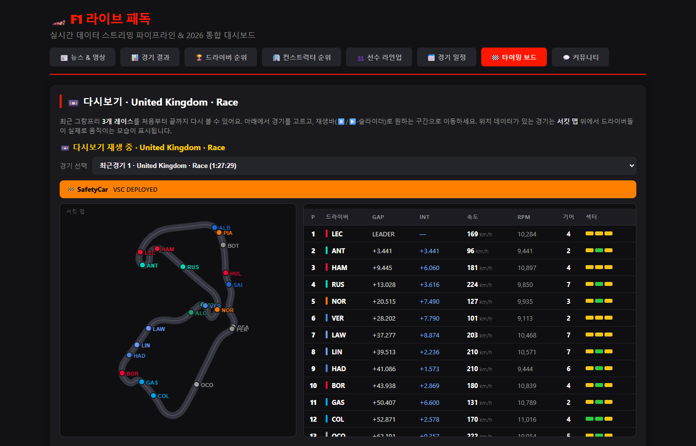
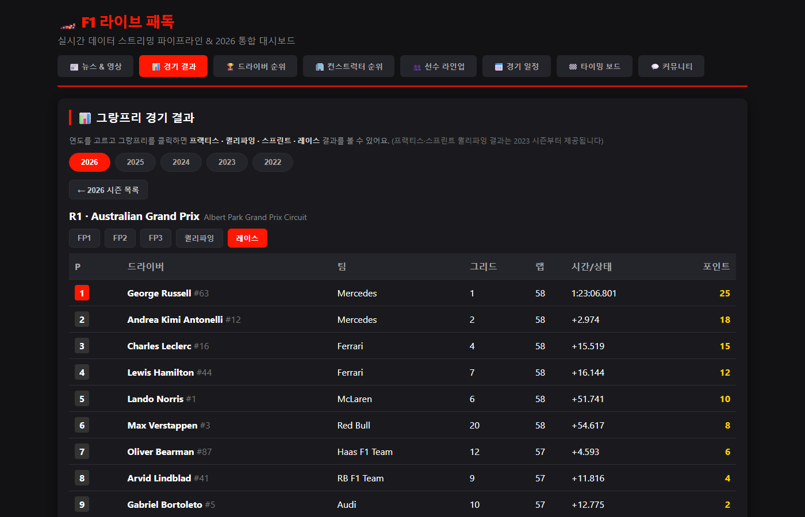
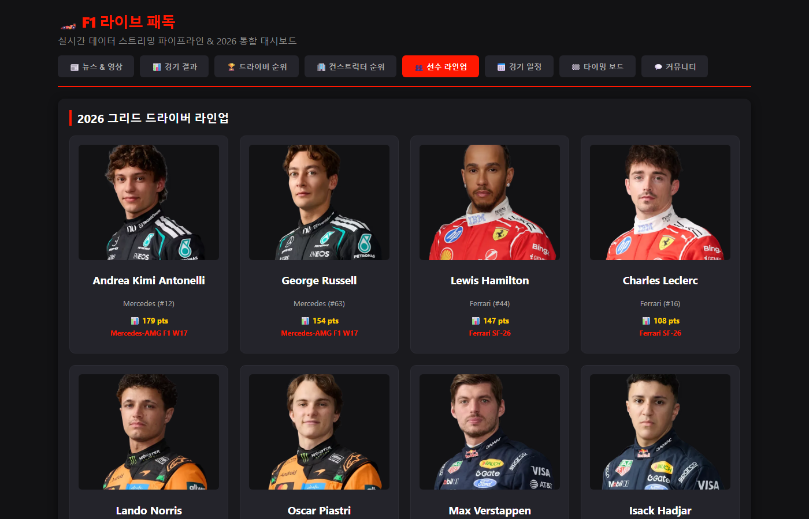
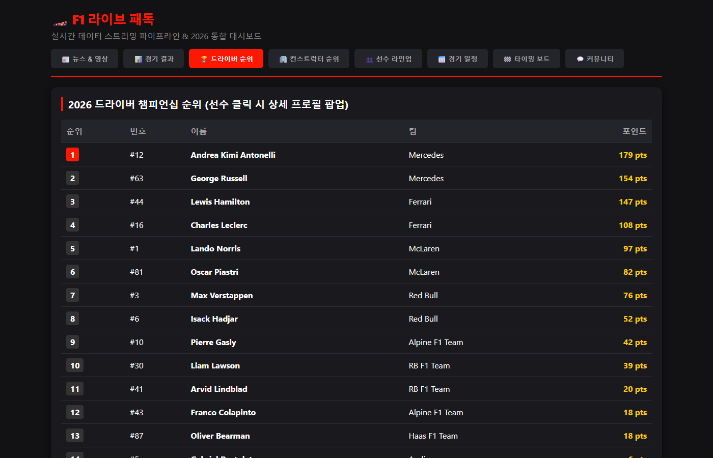
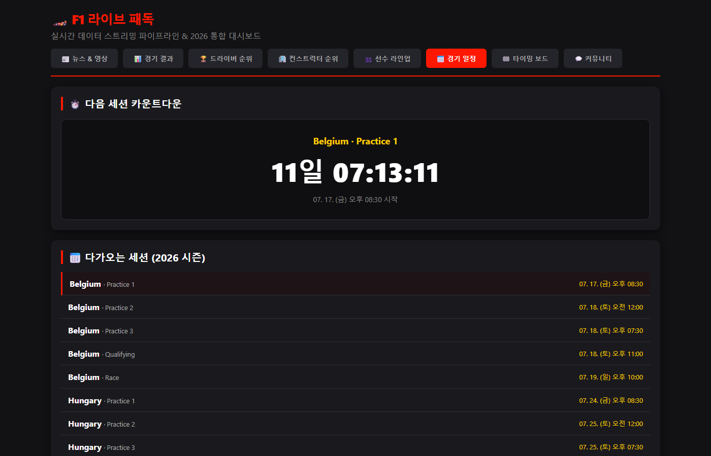
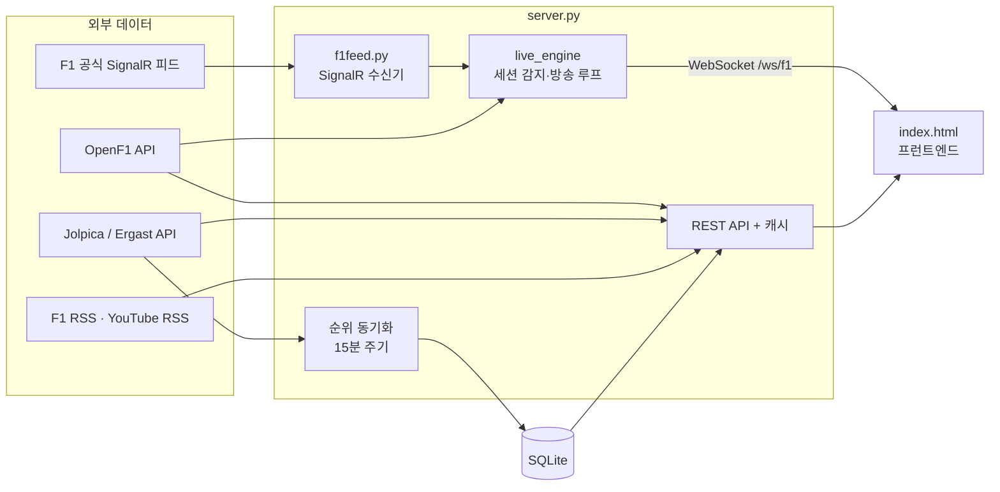

# 🏎️ F1 라이브 패독

F1 팬을 위한 통합 대시보드 — **실시간 타이밍 보드**, 시즌 순위, 경기 결과 아카이브, 일정 카운트다운, 공식 뉴스, 우승자 예측 커뮤니티를 하나의 웹 앱으로 제공합니다.

FastAPI + SQLite + 바닐라 JS로 만들었고, 외부 F1 데이터 API(OpenF1, Jolpica/Ergast, F1 공식 SignalR 피드)를 조합해 동작합니다.



## 주요 기능

| 탭 | 내용 |
|---|---|
| 🏁 타이밍 보드 | 세션 중엔 **라이브**(3초 주기 WebSocket 방송), 평소엔 최근 3개 GP 풀 레이스 **다시보기**(재생/일시정지/스크럽). 순위·갭·인터벌·속도·RPM·기어·섹터별 퍼플/그린/옐로 표시. **서킷 맵** 위에 전 차량의 실시간 위치를 팀 컬러 점으로 표시(프레임 사이 보간으로 부드럽게 이동). 재생 시점에 맞춘 **레이스 컨트롤 배너**(깃발·세이프티카·페널티), 타임라인 마커 클릭으로 듣는 **팀 라디오**, 드라이버 2명의 속도·갭을 겹쳐 보는 **텔레메트리 비교 차트**(호버 툴팁, 클릭으로 시점 이동) |
| 📊 경기 결과 | 2022~2026 시즌 전 그랑프리의 FP1~3 · 퀄리파잉 · 스프린트 · 레이스 결과 |
| 🏆 순위/라인업 | 드라이버·컨스트럭터 챔피언십 순위(15분 주기 자동 동기화), 드라이버 프로필 카드 |
| 📅 경기 일정 | 다음 세션 실시간 카운트다운 + 다가오는 세션 목록 |
| 📰 뉴스 & 영상 | F1 공식 RSS 뉴스(대표 이미지 포함) + 공식 유튜브 최신 영상 |
| 💬 커뮤니티 | 구글 OAuth 로그인, 자유게시판, 다음 레이스 **우승자 예측 게임** |

| | |
|---|---|
|  |  |
|  |  |

## 아키텍처



**라이브 타이밍 파이프라인** — 백그라운드 태스크 하나(`live_engine`)가 전체 상태를 관리합니다:

1. **세션 감지**: 공식 일정이 아니라 **"데이터가 실제로 흐르는지"** 로 라이브 여부를 판단합니다. 지연 출발·레드 플래그·연장으로 공식 시각이 어긋나도 방송이 끊기지 않습니다.
2. **라이브**: OpenF1 폴링(3초) 또는 F1 공식 SignalR 피드에서 보드를 조립해 접속 중인 모든 WebSocket 클라이언트에 방송합니다.
3. **세션 종료**: 데이터가 5분간 끊기면 종료로 판단하고, OpenF1에 풀 데이터가 올라오는 대로 **자동 백필**해서 다시보기 파일을 생성합니다 (10분 간격 재시도).
4. **유휴**: 최근 레이스 다시보기를 재생합니다.

## 설계 결정

**왜 라이브 녹화 대신 세션 종료 후 백필인가?**
처음엔 라이브 방송 프레임을 그대로 저장하는 녹화를 구현했습니다. 그런데 F1이 2025년부터 공식 피드에 인증을 붙이면서, 무료(no-auth) 모드에서는 순위 외 데이터(인터벌·텔레메트리)가 빠질 수 있어 녹화본의 품질이 낮았습니다. 세션이 끝나면 OpenF1에 풀 데이터가 영구 보존되므로, **종료 감지 → 데이터가 올라올 때까지 재시도 → 백필**하는 방식으로 교체했습니다. 코드는 줄고 다시보기 품질은 올라갔습니다.

**다중 폴백 체인**
OpenF1 무료 티어는 라이브 세션 중 401을 반환합니다. 그래서 라이브는 `OpenF1 폴링 → F1 공식 SignalR 피드(FastF1)` 순으로 시도하고, 보드는 `라이브 → 최근 레이스 다시보기 → 정적 리플레이(바레인 2024)` 순으로 항상 뭔가를 보여줍니다. 일정 데이터도 시작 시 파일로 캐시해서 라이브 중 재시작해도 깨지지 않습니다.

**서킷 맵은 이미지 없이 데이터로 그린다**
타이밍 보드의 서킷 맵은 트랙 이미지를 쓰지 않습니다. 드라이버 위치는 OpenF1 `location` 좌표를 리플레이 프레임에 포함해 캔버스에 찍고, 서킷 외곽선은 **완주한 랩 하나의 좌표 궤적**으로 리플레이 생성 시 자동으로 만들어 냅니다. 덕분에 어떤 서킷이든 별도 에셋 준비 없이 맵이 그려지고, 좌표가 초당 ~3.7회뿐이라 끊겨 보이는 문제는 프레임 사이 선형 보간으로 해결했습니다. 외곽선 데이터가 없는 라이브 중에는 차들이 지나간 궤적을 누적해 한두 랩이 지나면 트랙 모양이 저절로 드러납니다.

**목적별 캐싱**
- 뉴스/영상 RSS: 10분 TTL 메모리 캐시 (실패 시 오래된 캐시라도 반환)
- 끝난 그랑프리 결과: 데이터가 완성됐을 때만 파일로 **영구 캐시** — 과거 시즌은 API를 다시 부르지 않음
- 시즌 순위: DB에 저장 + 15분 주기 재동기화 (경기 후 결과 자동 반영)

## 기술 스택

- **백엔드**: Python, FastAPI, WebSocket, SQLite, asyncio 백그라운드 태스크
- **프런트엔드**: 바닐라 JS/HTML/CSS (프레임워크 없음, 단일 파일)
- **데이터**: [OpenF1](https://openf1.org/) · [Jolpica/Ergast](https://github.com/jolpica/jolpica-f1) · F1 공식 SignalR 피드([FastF1](https://github.com/theOehrly/Fast-F1) 경유) · F1 공식 RSS/YouTube
- **인증**: 구글 OAuth 2.0 (authorization code flow 직접 구현)

## 실행 방법

```bash
pip install -r requirements.txt

# (선택) 다시보기 데이터 준비 — 없으면 보드가 비어 보일 수 있습니다
py build_live_replay.py     # 폴백 리플레이(바레인 2024) 생성
py build_recordings.py      # 최근 3개 GP 풀 레이스 다시보기 생성

py -m uvicorn server:app
# → http://localhost:8000
```

구글 로그인(커뮤니티 탭)을 쓰려면 [OAUTH_SETUP.md](OAUTH_SETUP.md)를 따라 `oauth_config.json`에 키를 설정하세요. 키가 없어도 나머지 기능은 모두 동작합니다.

## 한계와 다음 단계

- [ ] 테스트 코드 (pytest)
- [ ] 라우터/서비스 계층 분리 (현재 단일 `server.py`)
- [ ] 비동기 핸들러 내 동기 SQLite 호출 개선
- [ ] 로그인 세션 영속화 (현재 인메모리 → 재시작 시 로그아웃)
- [ ] 배포
- [ ] 예측 게임 채점·리더보드
